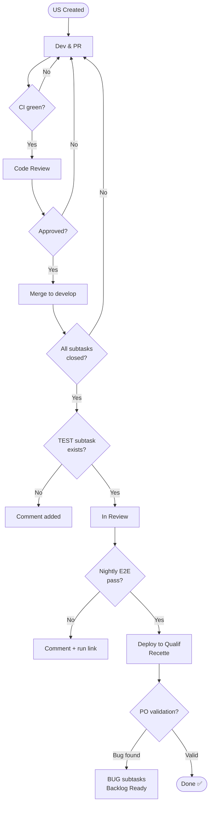

## Table of Contents

- [Introduction](#introduction)
- [Exigences transverses](#exigences-transverses)
  - [Accessibilité](#accessibilité-rgaa--wcag)
  - [Performance](#performance)
  - [Ergonomie et responsive](#ergonomie-et-responsive)
  - [Sécurité applicative](#sécurité-applicative)
  - [Compatibilité navigateurs](#compatibilité-navigateurs)
- [Cycle de vie d'une User Story](#cycle-de-vie-dune-user-story)
  - [1. Développement & Pull Requests](#1-développement--pull-requests)
  - [2. Intégration Continue (CI)](#2-intégration-continue-ci)
  - [3. Revue de code & Merge](#3-revue-de-code--merge)
  - [4. Vérification de complétion](#4-vérification-de-complétion-de-la-us)
  - [5. Validation nocturne](#5-validation-nocturne-dev)
  - [6. Qualification PO](#6-qualification-po)
  - [7. Clôture (Done)](#7-clôture-done)
- [Bonnes pratiques](#bonnes-pratiques)
- [Diagramme](#diagramme)
- [Workflow Visuel](#workflow-visuel)

---

## Introduction

Ce document définit les critères qu'une User Story (US) doit remplir pour être considérée comme **Done**.
Il s'applique à toutes les US du projet, sans exception.

Deux niveaux de critères doivent être satisfaits :
1. Les **exigences transverses** du projet (qualité, sécurité, accessibilité…)
2. Le **cycle de vie de la US** (développement, CI, qualification, validation PO)

⚠️ En cas de divergence, la version anglaise fait foi.

---

## Exigences transverses

Chaque US doit respecter les exigences transverses suivantes **avant d'être considérée Done**.
Ces critères s'appliquent en complément des vérifications automatiques de la CI.

### Accessibilité (RGAA / WCAG)

Le projet vise la conformité **WCAG 2.1 niveau AA**, en référence au **RGAA 4.1**.

**Vérifications automatiques (CI) :**
- Score [Axe](https://www.deque.com/axe/) : zéro violation de niveau critique ou sérieux
- Score Lighthouse Accessibility ≥ 90

**Vérifications manuelles (avant recette) :**
- Navigation clavier intégrale possible sur les composants ajoutés/modifiés
- Contrastes de couleur conformes (ratio ≥ 4.5:1 pour le texte normal)
- Attributs ARIA et labels présents et cohérents

> ⚠️ Les outils automatiques ne couvrent qu'environ 30 % des critères WCAG. La vérification manuelle est obligatoire pour les composants interactifs.

---

### Performance

**Frontend :**
- Lighthouse Performance ≥ 80 (sur la page impactée par la US)
- Pas d'augmentation significative du bundle size (> +50 KB non justifié)
- LCP (Largest Contentful Paint) < 2.5 s

**Backend :**
- Temps de réponse API < 500 ms (hors cas particuliers documentés)
- Pagination obligatoire sur toute liste pouvant dépasser 50 éléments
- Utilisation de DTOs et de `FetchType.LAZY` (cf. [Developer's agreements](../dev-handbook/#performance))

---

### Ergonomie et Responsive

- Rendu vérifié sur les **breakpoints** : mobile (< 768 px), tablette (768–1024 px), desktop (> 1024 px)
- Respect du **design system** du projet (composants, typographie, couleurs)
- Pas de débordement de contenu ni de scroll horizontal non intentionnel
- Validation UX sur les US impliquant des interactions utilisateur significatives

---

### Sécurité applicative

**Vérifications automatiques (CI) :**
- Zéro vulnérabilité de niveau **critique ou élevé** non traitée dans les scans (Snyk / Dependabot / OWASP Dependency-Check)
- Pas de secret ou credential commité (scan de type git-secrets ou trufflehog)

**Vérifications manuelles (US sensibles) :**
- Contrôle d'accès vérifié (authentification, autorisations)
- Pas d'exposition de données personnelles non nécessaires
- Entrées utilisateur validées et assainies côté serveur

> Référentiel de référence : [OWASP Top 10](https://owasp.org/www-project-top-ten/)

---

### Compatibilité navigateurs

Le projet supporte les navigateurs suivants dans les **deux dernières versions stables** :

| Navigateur | Versions supportées |
|---|---|
| Chrome | 2 dernières versions |
| Firefox | 2 dernières versions |
| Safari | 2 dernières versions |
| Edge (Chromium) | 2 dernières versions |

- La configuration **Browserslist** du projet fait foi
- Les US frontend sont vérifiées manuellement sur au moins Chrome + Firefox avant recette
- Les spécificités Safari (WebKit) sont vérifiées pour les US impliquant des interactions complexes

---

## Cycle de vie d'une User Story

### 1. Développement & Pull Requests

- Chaque US est découpée en **sous-tâches**
- Chaque sous-tâche est liée à une **Pull Request dédiée**
- Chaque PR est **liée à sa sous-tâche correspondante**

---

### 2. Intégration Continue (CI)

Pour chaque PR, la CI vérifie automatiquement :

- Tests Unitaires (TU) [BE & FE]
- Tests d'Intégration (IT) [BE]
- Tests End-to-End (E2E) [FE]
- Tests d'accessibilité automatiques [FE]
- Règles de linting [BE & FE]
- Scans de sécurité (détection de vulnérabilités) [BE & FE]

👉 Tous les checks doivent être verts avant le merge.

---

### 3. Revue de code & Merge

- La PR doit être **revue et approuvée**
- Une fois approuvée et la CI verte :
  - La PR est **rebasée et mergée dans `develop`**
  - La **sous-tâche est automatiquement clôturée**

---

### 4. Vérification de complétion de la US

Quand toutes les sous-tâches sont clôturées :

- Un workflow vérifie la présence d'une **sous-tâche de test `[TEST]`**
- Si absente : un commentaire est ajouté à la US
- Si présente : la US est automatiquement déplacée en **"In Review"** (prête pour déploiement qualification)

---

### 5. Validation nocturne (Dev)

Un workflow nocturne exécute les **tests E2E complets sur l'environnement de dev**.

- **Échec** : commentaire ajouté avec le lien de run ; la US reste inchangée
- **Succès** : déploiement déclenché vers l'environnement de qualification ; les US "In Review" passent en **"Recette"**

---

### 6. Qualification PO

Les Product Owners testent les US dans l'**environnement de qualification**.

- **Anomalie détectée** : création de sous-tâches `[BUG]` ; la US repasse en **"Backlog Ready"**
- **Validation** : le PO clique "Close issue"

---

### 7. Clôture (Done)

La clôture de la US la déplace automatiquement en **"Done"**. Elle est alors :

- ✅ Développée
- ✅ Testée (CI + nightly)
- ✅ Conforme aux exigences transverses
- ✅ Qualifiée
- ✅ Validée par les POs

---

## Bonnes pratiques

- Toujours lier les sous-tâches aux PRs
- S'assurer de la validation CI complète avant le merge
- Inclure une **sous-tâche `[TEST]`** dans chaque US
- Documenter les anomalies via des **sous-tâches `[BUG]`**
- Vérifier les exigences transverses **pendant le développement**, pas seulement en fin de sprint
- S'appuyer sur l'automatisation pour réduire les erreurs manuelles

---

## Diagramme

```
╔════════════╦═══════════════╦══════════════╦═══════════════╦═══════════════╦══════════╗
║   US       ║   Dev / PR    ║     CI       ║   In Review   ║    Recette    ║   Done   ║
╠════════════╬═══════════════╬══════════════╬═══════════════╬═══════════════╬══════════╣
║ Created    ║ Subtasks + PR ║ Tests + Scan ║ Ready deploy  ║ PO validation ║          ║
║            ║ Code review   ║ All green    ║ Nightly E2E   ║ Bug → Backlog ║   ✓      ║
╚════════════╩═══════════════╩══════════════╩═══════════════╩═══════════════╩══════════╝
```

---

## Workflow Visuel

