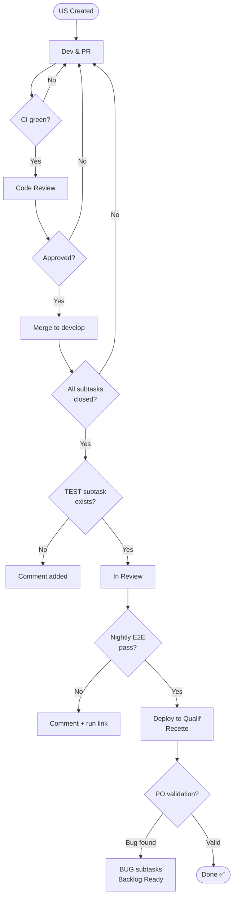

## Table of Contents

- [Introduction](#introduction)
- [Cross-cutting Requirements](#cross-cutting-requirements)
  * [Accessibility](#accessibility-rgaa--wcag)
  * [Performance](#performance)
  * [UX & Responsive Design](#ux--responsive-design)
  * [Application Security](#application-security)
  * [Browser Compatibility](#browser-compatibility)
- [User Story Lifecycle](#user-story-lifecycle)
  * [1. Development & Pull Requests](#1-development--pull-requests)
  * [2. Continuous Integration (CI)](#2-continuous-integration-ci)
  * [3. Code Review & Merge](#3-code-review--merge)
  * [4. User Story Completion Check](#4-user-story-completion-check)
  * [5. Nightly Validation](#5-nightly-validation-dev-environment)
  * [6. Qualification by Product Owners](#6-qualification-by-product-owners-po)
  * [7. Completion (Done)](#7-completion-done)
- [Good Practices](#good-practices)
- [Diagram](#diagram)
- [Visual Workflow](#visual-workflow)

---

## Introduction

This document defines the criteria a User Story (US) must meet to be considered **Done**.
It applies to **all User Stories** in the project, without exception.

Two levels of criteria must be satisfied:

1. **Cross-cutting requirements** — quality, security, accessibility, etc.
2. **User Story lifecycle** — development, CI, qualification, PO validation.

---

## Cross-cutting Requirements

Every User Story must comply with the following requirements **before it can be considered Done**.
These criteria apply in addition to the automated checks performed by the CI pipeline.

### Accessibility (RGAA / WCAG)

The project targets **WCAG 2.1 level AA** conformance, as required by the French **RGAA 4.1** standard.

**Automated checks (CI):**
- Zero Axe violations at *critical* or *serious* level
- Lighthouse Accessibility score ≥ 90

**Manual checks (before qualification):**
- Full keyboard navigation possible on all added or modified components
- Colour contrast compliant (ratio ≥ 4.5:1 for normal text)
- ARIA attributes and labels present and consistent

> ⚠️ Automated tools cover approximately 30 % of WCAG criteria. Manual verification is **mandatory** for interactive components.

---

### Performance

**Frontend:**
- Lighthouse Performance score ≥ 80 on pages affected by the US
- No significant bundle size increase (> +50 KB must be justified)
- LCP (Largest Contentful Paint) < 2.5 s

**Backend:**
- API response time < 500 ms (exceptions must be documented)
- Pagination required on any list that may exceed 50 items
- Use of DTOs and `FetchType.LAZY` — see [Developer's agreements](../dev-handbook/#performance)

---

### UX & Responsive Design

- Rendering verified on the following breakpoints: mobile (< 768 px), tablet (768–1024 px), desktop (> 1024 px)
- Compliance with the project design system (components, typography, colours)
- No content overflow or unintentional horizontal scroll
- UX review required for User Stories involving significant user interactions

---

### Application Security

**Automated checks (CI):**
- Zero *critical* or *high* severity unresolved vulnerabilities in scans (Snyk / Dependabot / OWASP Dependency-Check)
- No secrets or credentials committed (git-secrets or trufflehog scan)

**Manual checks (for sensitive User Stories):**
- Access control verified (authentication, authorisation)
- No unnecessary personal data exposed
- User inputs validated and sanitised server-side

> Reference: [OWASP Top 10](https://owasp.org/www-project-top-ten/){:target="_blank"}

---

### Browser Compatibility

The project supports the following browsers at their **last two stable versions**:

| Browser | Supported versions |
|---|---|
| Chrome | Last 2 versions |
| Firefox | Last 2 versions |
| Safari | Last 2 versions |
| Edge (Chromium) | Last 2 versions |

- The project **Browserslist** configuration is the reference
- Frontend User Stories must be manually checked on at least Chrome + Firefox before qualification
- Safari (WebKit) specifics must be verified for User Stories involving complex interactions

---

## User Story Lifecycle

### 1. Development & Pull Requests

- Each User Story is split into **subtasks**.
- Each subtask must be implemented via a **dedicated Pull Request (PR)**.
- Each PR must be **linked to its corresponding subtask**.

---

### 2. Continuous Integration (CI)

For each PR, the CI pipeline automatically verifies:

- Unit Tests (TUs) [BE & FE]
- Integration Tests (IT) [BE]
- End-to-End Tests (E2E) [FE]
- Accessibility tests [FE]
- Linting rules [BE & FE]
- Security scans (vulnerability detection) [BE & FE]

👉 All checks must pass successfully before merging.

---

### 3. Code Review & Merge

- The PR must be **reviewed and approved**.
- Once approved and CI is green:
  * The PR is **rebased and merged into `develop`**.
  * The associated **subtask is automatically closed**.

---

### 4. User Story Completion Check

When all subtasks of a User Story are closed:

- A workflow checks if a **`[TEST]` subtask** (developer qualification) exists.
- If missing: a **comment is added** to the User Story.
- If present: the User Story is automatically moved to **"In Review"**
  👉 This status means *ready for qualification deployment*.

---

### 5. Nightly Validation (Dev Environment)

A nightly workflow runs full **E2E tests on the development environment**.

**If tests fail:**
- A **comment is added** with the failing run link.
- The User Story remains unchanged.

**If tests pass:**
- A **deployment to the qualification environment is triggered**.
- All User Stories in **"In Review"** are moved to **"Recette"**.

---

### 6. Qualification by Product Owners (PO)

Product Owners test the User Stories in the **qualification environment**.

**If issues are detected:**
- They create **`[BUG]` subtasks** under the User Story.
- The User Story is automatically moved back to **"Backlog Ready"**.

**If everything is valid:**
- The PO clicks **"Close issue"**.

---

### 7. Completion (Done)

Closing the User Story automatically moves it to **"Done"**. The User Story is now:

- ✅ Fully developed
- ✅ Tested (CI + nightly)
- ✅ Compliant with cross-cutting requirements
- ✅ Qualified
- ✅ Validated by POs

---

## Good Practices

- Always link subtasks to PRs.
- Ensure full CI validation before merging.
- Include a **`[TEST]` subtask** in every User Story.
- Document issues via **`[BUG]` subtasks**.
- Verify cross-cutting requirements **during development**, not only at the end of a sprint.
- Rely on automation to reduce manual errors.

---

## Diagram

```
╔════════════╦═══════════════╦══════════════╦═══════════════╦═══════════════╦══════════╗
║   US       ║   Dev / PR    ║     CI       ║   In Review   ║    Recette    ║   Done   ║
╠════════════╬═══════════════╬══════════════╬═══════════════╬═══════════════╬══════════╣
║ Created    ║ Subtasks + PR ║ Tests + Scan ║ Ready deploy  ║ PO validation ║          ║
║            ║ Code review   ║ All green    ║ Nightly E2E   ║ Bug → Backlog ║   ✓      ║
╚════════════╩═══════════════╩══════════════╩═══════════════╩═══════════════╩══════════╝
```

---

## Visual Workflow

